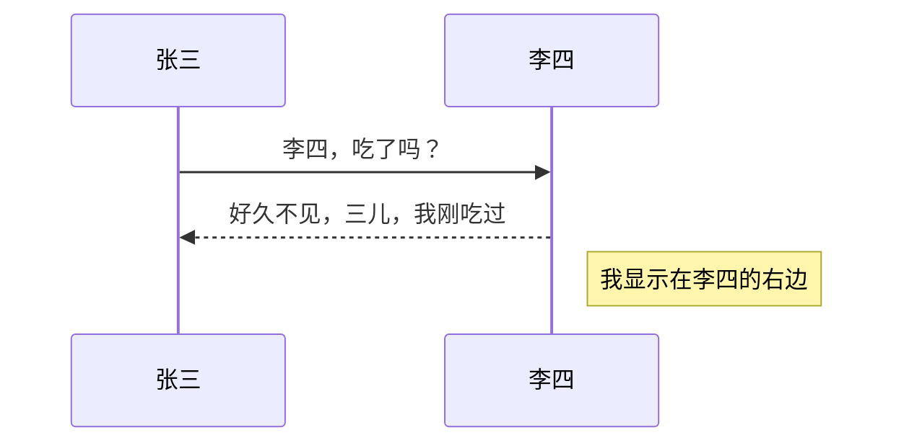
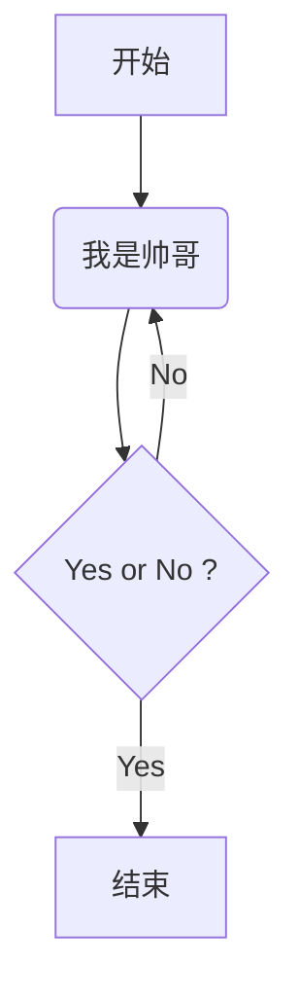
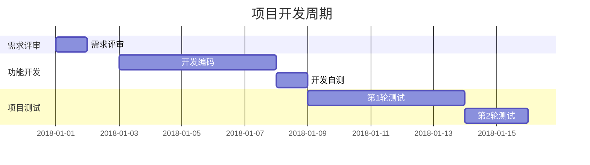
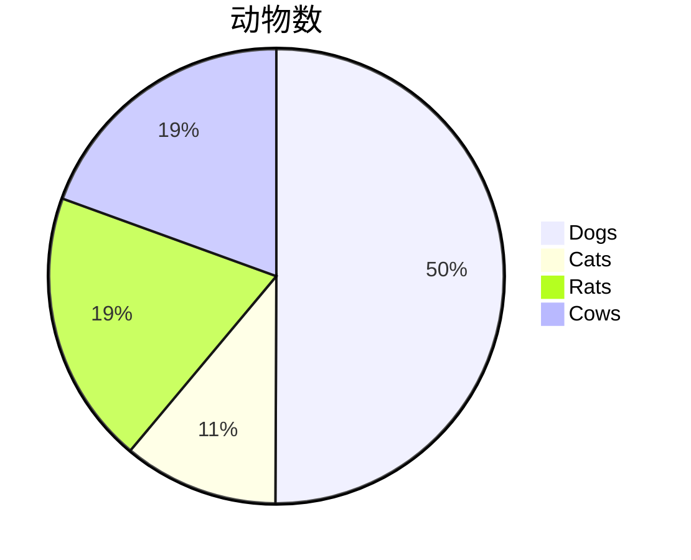
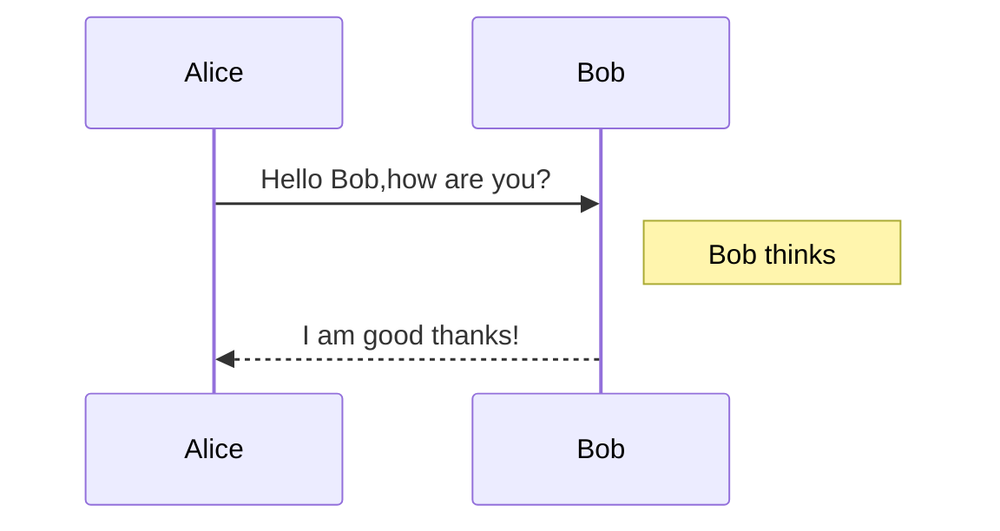
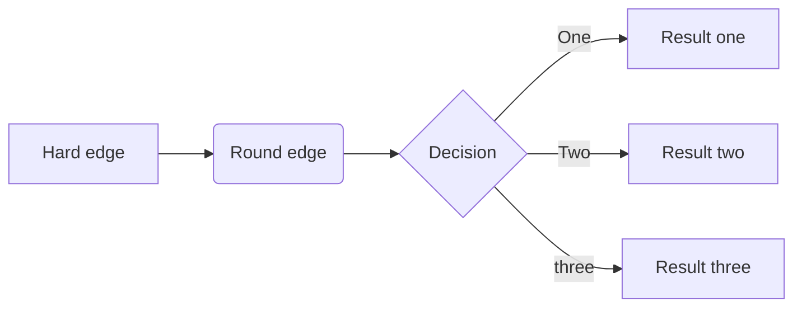
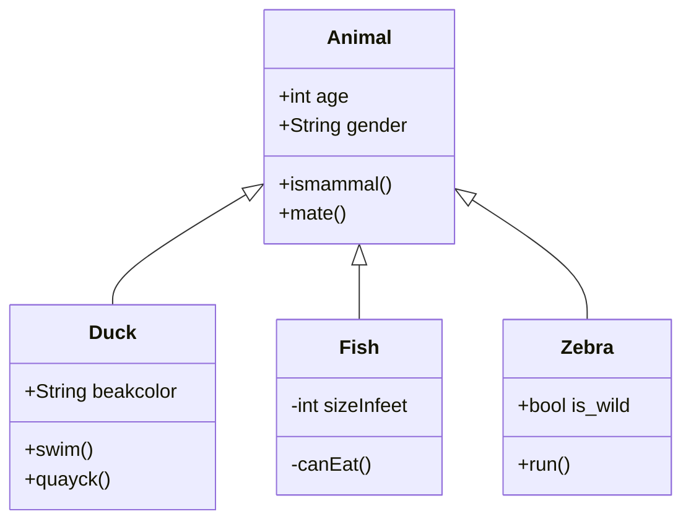
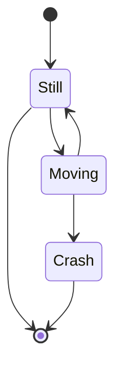

# 文档标题

作者

摘要

目录

## 标题1

### 标题1.1

## 标题2

### 标题2.1

### 标题2.2

**加粗内容**

__加粗内容,不推荐__

*斜体内容*

_斜体内容，不推荐_

# 有序列表

1. 我有一个梦想

2. 我有两个梦想

3. 我有三个梦想

   

# 无序列表

## 使用星号

* 使用【*】标识无序列表

## 使用加号
+ 使用【+】标识无序列表

## 使用减号

- 使用【-】标识无序列表


## 嵌套列表

+ 我是第一层列表
  + 我是第二层列表
    + 我是第三层列表
      + 我是第四层列表

## 有序列表和无序列表相互嵌套

1. 我是第一层列表
   + 我是第二层列表
     1. 我是第三层列表
     2. 我也是第三层列表

建议使用-标识


## 分割线

### 星号

***

### 减号

---

### 下划线

___


## 图片


### 文字链接

[链接文字]（链接地址）

### 网址链接

<URL或邮箱地址>

### 行内代码

使用`cd ..`命令切换到上一级目录

使用`mkdir 文件夹`命令创建文件夹

### 代码块

以Tab键或者4个空格开头

以Tab键开头

​	def  test_print();

或者以4个空格开头

​    def  test_print();

### 围栏代码块

代码超过1行，使用围栏代码块，便于阅读，支持语法高亮

用```开头，后跟语言类型

```shell
$echo "test"
test
```

```python
def test_printf():
    pass
```


### 引用

用>引用内容

> 在此处引用

### 转义

\特殊字符

### 删除线

~~被删除的文字~~

### 表情符号

：表情符号：

[更多表情符号见：]（www.webpagefx.com/tools/emoji-cheat-sheet/）

### 表格

| 表头1 | 表头2 | 表头3 |
| :----- | :-----: | -----: |
| 内容1 | 内容2 | 内容3|

### 任务列表

- [ ] 未勾选

- [x] 已勾选

### 锚点

[锚点描述](#锚点名)


## 数学表达式

1. 分数 $\frac{分子}{分母}$ or $分子\over 分母$ 
2. 开方 $\sqrt[9]{3}$ or $\sqrt{3}$
3. 省略号 $\ldots$ or $\cdots$ 
4. 矢量 $\vec{a} \cdot \vec{b} = 0$ 
5. 一阶导数 二阶导数 $\dot{a}$ $\ddot{a}$ 
6. 积分 $\int _0^1 x^2{\rm d}x$ 
7. 极限 $\lim_{n\rightarrow+\infty}\frac{1}{n(n+1)}$  $\lim\limits_{n\rightarrow+\infty}\frac{1}{n(n+1)}$
8. 累加 累乘 $\sum_1^n\frac{1}{x^2}$  $\prod_{i=0}^n\frac{1}{x^2}$ $\sum\limits_1^n\frac{1}{x^2}$ $\prod\limits_{i=0}^n\frac{1}{x^2}$ 
9. 希腊字母 $\alpha$ $\Alpha$ $\beta$ $\Beta$ $\gamma$ $\Gamma$ $\delta$ $\Delta$ $\epsilon$ $\Epsilon$ $\zeta$ $\Zeta$ $\eta$ $\Eta$ $\theta$ $\Theta$ $\iota$ $\Iota$ $\kappa$ $\Kappa$ $\lambda$ $\Lambda$ $\mu$ $\Mu$ $\nu$ $\Nu$ $\xi$ $\Xi$ $\omicron$ $\Omicron$ $\pi$ $\Pi$ $\rho$ $\Rho$ $\sigma$ $\Sigma$ $\tau$ $\Tau$ $\upsilon$ $\Upsilon$ $\phi$ $\Phi$ $\chi$ $\Chi$ $\psi$ $\Psi$ $\omega$ $\Omega$ 
10. 数学符号 $\pm$ $\mp$ $\times$ $\div$ $\mid$ $\cdot$ $\circ$ $\ast$ $\bigodot$ $\bigotimes$ $\bigoplus$ $\le$ $\ge$ $\neq$ $\approx$ $\equiv$ $\sum$ $\prod$ $\coprod$ $\gt$ $\lt$ 
11. 集合运算符 $\emptyset$ $\in$ $\notin$ $\subset$ $\supset$ $\subseteq$ $\supseteq$ $\bigcap$ $\bigcup$ $\bigvee$ $\bigwedge$ $\biguplus$ $\bigsqcup$ 
12. 对数运算符 $\log$ $\lg$ $\ln$ 
13. 三角运算符 $\bot$ $\angle$ $30^\circ$ $\sin$ $\cos$ $\tan$ $\cot$ $\sec$ $\csc$ 
14. 微积分运算符  $\prime $  $\int$ $\iint$ $\iiint$ $\oint$ $\lim$ $\infty$ $\nabla$ $\part$ 
15. 逻辑运算符 $\because$ $\therefore$ $\forall$ $\exists$ $\not=$ $\not>$ $\not\subset$ 
16. 戴帽符号 $\hat{y}$ $\check{y}$ $\breve{y}$ 
17. 鄂化符号 $\widetilde{a}$ 
18. 箭头符号 $\uparrow$ $\downarrow$ $\Uparrow$ $\Downarrow$ $\rightarrow$ $\leftarrow$ $\Rightarrow$ $\Leftarrow$ $\longrightarrow$ $\longleftarrow$ $\Longrightarrow$ $\Longleftarrow$ 
19. 字体 ${\rm 罗马体}$  ${\bf 黑体}$ ${\mit 数学斜体}$   $\it 意大利体$ $\cal 花体$ $\sf 等线体$ $\tt 打字机字体$ 
20. 连线符号 $\overline{a+b+c+d}$ $\underline{a+b+c+d}$

ex:$r=\frac{\sum_{i=1}^{n}(x_i-\bar{x})(y_i-\bar{y})}{\sqrt{\sum_{i=1}^{n}(x_i-\bar{x})^2\sum_{i=1}^{n}(y_i-\bar{y})^2}}$ $r=\frac{\sum\limits_{i=1}^{n}(x_i-\bar{x})(y_i-\bar{y})}{\sqrt{\sum\limits_{i=1}^{n}(x_i-\bar{x})^2\sum\limits_{i=1}^{n}(y_i-\bar{y})^2}}$ 

19. 矩阵: $$\begin{matrix} 0&1&1\\ 1&1&0\\ 1&0&1\\ \end{matrix}$$ ,matrix 可以替换为 pmatrix:小括号边框；bmatrix 中括号边框；Bmatrix 大括号边框；vmatrix 单竖线边框；Vmatrix 双竖线边框。

20. 矩阵省略元素：$$\begin{bmatrix} {a_{11}}&{a_{12}}&{\cdots}&{a_{1n}}\\ {a_{21}}&{a_{22}}&{\cdots}&{a_{2n}} \\{\vdots}&{\vdots}&{\ddots}&{\vdots} \\ {a_{m1}}&{a_{m2}}&{\cdots}&{a_{mn}} \end{bmatrix}$$ 

21. 阵列：$$\begin{array}{c|lll}{\downarrow}&{a}&{b}&{c} \\ \hline \\{R_1}&{a}&{b}&{c}\\ {R_2}&{b}&{c}&{c} \end{array}$$ 

22. 方程组:$$\begin{cases} a_1x+b_1y+c_1z=d_1 \\ a_2x+b_2y+c_2z=d_2 \\ a_3x+b_3y+c_3z=d_3 \end{cases}$$ 

    

    # 数学符号大全

    1. 希腊和希伯来字母

       $\alpha \beta \chi \delta \epsilon \eta \gamma \iota \kappa \lambda \mu \nu \omega \phi \pi \psi \rho \sigma \tau \theta \upsilon \xi \zeta \digamma \varepsilon \varkappa \varphi \varpi \varrho \varsigma \vartheta \aleph \beth \daleth \gimel$

    2. 数学结构

       $\sqrt[3]{abc}$、$\overline{abc}$、$\underline{abc}$、$\widehat{abc}$、$\widetilde{abc}$、$\overrightarrow{abc}$、$\overleftarrow{abc}$、$\overbrace{abc}$、$\underbrace{abc}$ 

    3. 分割符

       $\vert$、$\Vert$、$\langle$、$\rangle$、$\lfloor$、$\rfloor$、$\lceil$、$\rceil$、$\Uparrow$、$\uparrow$、$\Downarrow$、$\downarrow$、$\llcorner$、$\lrcorner$、$\ulcorner$、$\urcorner$

    4. 可变大小的符号

    5. $\sum$、$\prod$、$\coprod$、$\int$、$\oint$、$\iint$、$\iiint$、$\biguplus$、$\bigcap$、$\bigcup$、$\bigoplus$、$\bigotimes$、$\bigodot$、$\bigvee$、$\bigwedge$、$\bigsqcup$

    6. 二进制 关系符号

       $\ast$、$\star$、$\cdot$、$\circ$、$\bullet$、$\bigcirc$、$\diamond$、$\times$、$\div$、$\pm$、$\mp$、$\amalg$、$\odot$、$\ominus$、$\oplus$、$\oslash$、$\otimes$、$\wr$、$\Box$、$\boxplus$、$\boxminus$、$\boxdot$、$\square$、$\cap$、$\cup$、$\uplus$、$\sqcap$、$\sqcup$、$\wedge$、$\vee$、$\dagger$、$\ddagger$、$\barwedge$、$\curlywedge$、$\Cap$、$\bot$、$\intercal$、$\doublebarwedge$、$\lhd$、$\rhd$、$\triangleleft$、$\triangleright$、$\unlhd$、$\unrhd$、$\bigtriangledown$、$\bigtriangleup$、$\setminus$、$\veebar$、$\curlyvee$、$\Cup$、$\top$、$\rightthreetimes$、$\leftthreetimes$、$\approxeq$、$\thicksim$、$\backsim$、$\backsimeq$、$\triangleq$、$\circeq$、$\bumpeq$、$\Bumpeq$、$\doteqdot$、$\thickapprox$、$\fallingdotseq$、$\risingdotseq$、$\varpropto$、$\therefore$、$\because$、$\eqcirc$、$\neq$、$\leqq$、$\leqslant$、$\lessapprox$、$\lll$、$\lessdot$、$\lesssim$、$\eqslantless$、$\precsim$、$\precapprox$、$\Subset$、$\subseteqq$、$\sqsubset$、$\curlyeqprec$、$\blacktriangleleft$、$\trianglelefteq$、$\vartriangleleft$、$\geqq$、$\geqslant$、$\gtrapprox$、$\ggg$、$\gtrdot$、$\gtrsim$、$\eqslantgtr$、$\succsim$、$\succapprox$、$\Supset$、$\supseteqq$、$\sqsupset$、$\curlyeqsucc$、$\blacktriangleright$、$\trianglerighteq$、$\vartriangleright$、$\lessgtr$、$\lesseqgtr$、$\lesseqqgtr$、$\gtreqless$、$\gtreqqless$、$\gtreqless$、$\gtrless$、$\backepsilon$、$\between$、$\pitchfork$、$\shortmid$、$\smallfrown$、$\smallsmile$、$\vDash$、$\shortparallel$、$\nshortparallel$、$\ncong$、$\nleq$、$\ngeq$、$\nsubseteq$、$\nmid$、$\nleqq$、$\ngeqq$、$\nsupseteq$、$\nparallel$、$\nleqslant$、$\ngeqslant$、$\nsubseteqq$、$\nless$、$\ngtr$、$\nsupseteqq$、$\nprec$、$\nsucceq$、$\supsetneq$、$\nsim$、$\npreceq$、$\nsucceq$、$\supsetneq$、$\nvDash$、$\precnsim$、$\succnsim$、$\supsetneqq$、$\nvdash$、$\lnapprox$、$\gnapprox$、$\varsubsetneq$、$\ntriangleleft$、$\lneq$、$\gneq$、$\varsubsetneq$、$\ntriangleleft $、$\lneqq$、$\gneqq$、$\varsubsetneqq$、$\ntriangleright$、$\lnsim$、$\gnsim$、$\varsupsetneqq$、$\ntrianglerighteq$、$\lvertneqq$、$\gvertneqq$、

    7.箭头符号

    $\leftarrow$、$\longleftarrow$、$\uparrow$、$\Leftarrow$、$\Longleftarrow$、$\Uparrow$、$\rightarrow$、$\longrightarrow$、$\downarrow$、$\Rightarrow$、$\Longrightarrow$、$\Downarrow$、$\leftrightarrow$、$\longleftrightarrow$、$\updownarrow$、$\Leftrightarrow$、$\Longleftrightarrow$、$\Updownarrow$、$\mapsto$、$\longmapsto$、$\nearrow$、$\hookleftarrow$、$\hookrightarrow$、$\searrow$、$\leftharpoonup$、$\rightharpoonup$、$\swarrow$、$\leftharpoondown$、$\rightharpoondown$、$\nwarrow$、$\rightleftharpoons$、$\leadsto$、$\dashrightarrow$、$\dashleftarrow$、$\leftleftarrows$、$\leftrightarrows$、$\Lleftarrow$、$\twoheadleftarrow$、$\leftarrowtail$、$\looparrowleft$、$\leftrightharpoons$、$\curvearrowleft$、$\circlearrowleft$、$\Lsh$、$\upuparrows$、$\upharpoonleft$、$\downharpoonleft$、$\multimap$、$\leftrightsquigarrow$、$\rightrightarrows$、$\rightleftarrows$、$\rightrightarrows $、$\twoheadrightarrow$、$\rightarrowtail$、$\looparrowright$、$\curvearrowright$、$\circlearrowright$、$\Rsh$、$\downdownarrows$、$\upharpoonright$、$\downharpoonright$、$\rightsquigarrow$、$\nleftarrow$、$\nrightarrow$、$\nLeftarrow$、$\nRightarrow$、$\nleftrightarrow$、$\nLeftrightarrow$

    8. 杂项符号

       $\infty$、$\nabla$、$\partial$、$\eth$、$\clubsuit$、$\heartsuit$、$\spadesuit$、$\cdots$、$\forall$、$\exists$、$\nexists$、$\emptyset$、$\imath$、$\jmath$、$\ell$、$\iiint$、$\iint$、$\int$、$\sharp$、$\flat$、$\natural$、$\wp$、$\angle$、$\measuredangle$、$\sphericalangle$、$\blacklozenge$、$\Bbbk$、$\bigstar$、$\diagdown$、$\diagup$、$\Finv$、$\Game$、$\hbar$、$\hslash$、$\lozenge$、$\mho$、$\prime$、$\square$、$\surd$、$\backprime$、$\circledS$

    9. 数学模式重音

       $\acute{A}$、$\bar{A}$、$\acute{\acute{A}}$、$\bar{\bar{A}}$、$\breve{a}$、$\check{a}$、$\breve{\breve{a}}$、$\check{\check{a}}$、$\ddot{a}$、$\dot{a}$、$\ddot{\ddot{a}}$ 、$\dot{\dot{a}}$、$\grave{a}$、$\grave{\grave{a}}$、$\hat{a}$、$\hat{\hat{a}}$、$\tilde{a}$、$\vec{a}$、$\tilde{\tilde{a}}$、$\vec{\vec{a}}$。

    10. 其他数学样式

        印刷字体$\mathcal{A}$、$\mathcal{B}$、$\mathcal{C}$、$\mathcal{D}$、$\mathcal{D}$、$\mathcal{E}$、$\mathcal{F}$、$\mathcal{G}$、$\mathcal{H}$、

        数学字母$\mathbb{A}$、$\mathbb{B}$、$\mathbb{C}$、$\mathbb{D}$、$\mathbb{E}$、$\mathbb{F}$、$\mathbb{A}$、$\mathbb{G}$、$\mathbb{H}$、

        马弗雷克信：$\mathfrak{A}$、$\mathfrak{B}$、$\mathfrak{C}$、$\mathfrak{D}$、$\mathfrak{E}$、$\mathfrak{F}$、$\mathfrak{G}$、$\mathfrak{H}$、

        无衬线字母类型:$\mathsf{A}$、$\mathsf{B}$、$\mathsf{C}$、$\mathsf{D}$、$\mathsf{E}$、$\mathsf{A}$、$\mathsf{F}$、$\mathsf{F}$、

        加粗：$\mathbf{A}$ 

    [Markdown 数学符号大全_surpassLiang的博客-CSDN博客](https://blog.csdn.net/oYinHeZhiGuang/article/details/119943358)

     

 

## 常用标记

**粗体** 、*斜体*、==高亮==、~~删除线~~、<u>下划线</u>、我是^上标^、我是~下标~、[超链接](www.baidu.com)、

### 无序列表

- 无序列表1
- 无序列表2

### 有序列表

1. 有序列表
2. 有序列表

### 任务列表

- [ ] 看电影

- [x] 听音乐

### 数学公式

分数 $ f(x,y) = \frac{x^2} {y^3} $

开根号 $ f(x,y) = \sqrt[n] {{x^2} {y^3}} $

省略号 $ f(x_1,x_2,\ldots,x_n)=x_1+x_2+\cdots+x_n $

<!--我是注释-->
$$
\mathbf{V}_1\times\mathbf{V}_2 = \begin{vmatrix}
\mathbf{i} & \mathbf{j} & \mathbf{k} \\
\frac{\partial X} {\partial u} & \frac{\partial Y} {\partial u} & 0\\
\frac{\partial X} {\partial u} & \frac{\partial Y} {\partial u} & 0\\
\end{vmatrix}
$$

### 脚注

我们可以这样引用一个脚注[^参考]

[^参考]: 这段文字是对脚注的描述


## 不同宽度的空格

+ 两个quad空格：$a \qquad b$ 

+ quad空格：$a\quad b$ 

+ 大空格：$a\ b$

+ 中等空格：$a\;b$

+ 小空格：$a\,b$

+ 没有空格：$ab$

+ 紧贴：$a\!b$ 

  

### 序列图

```sequence
张三->李四:李四,吃了吗？
note right of 李四:我现实在李四的右边
李四-->张三:好久不见，三儿，我刚吃过！
```


### 流程图

```flow
st=>start: 开始
op=>operation: 我是帅哥
cond=>condition: Yes or No ?
e=>end: 结束

st->op->cond
cond(yes)->e
cond(no)->op
```

### Mermaid序列图



### Mermaid流程图



### Mermaid甘特图



### 使用HTML标签


推荐使用样式给文字添加颜色<span style="color:green">绿色</span><span style="color:#fa0;font-size:20px">黄色</span><span style="color:red;font-size:30px">红色</span>


2021add


+++











