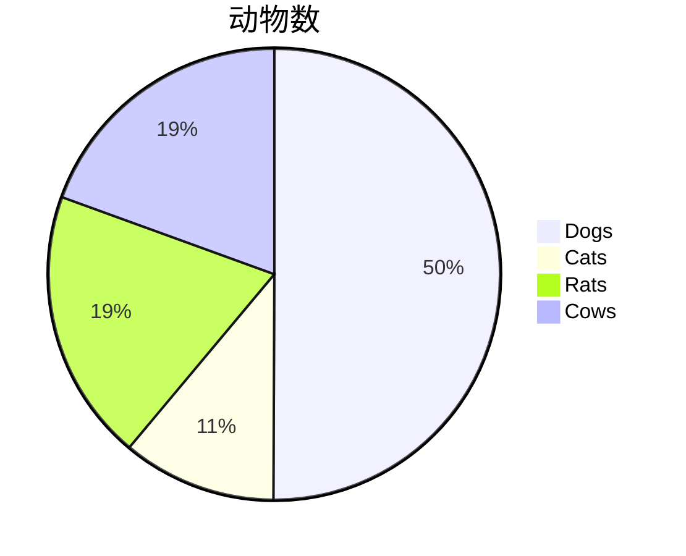
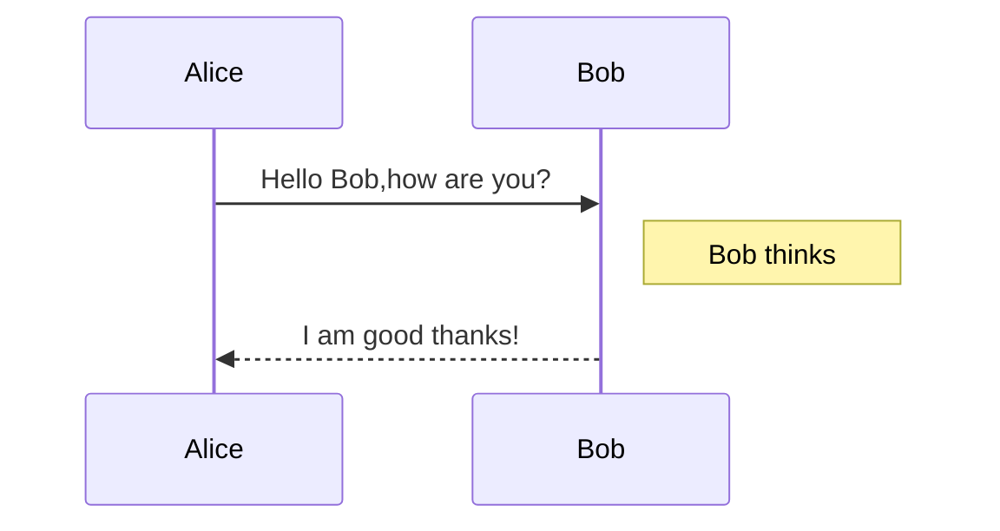
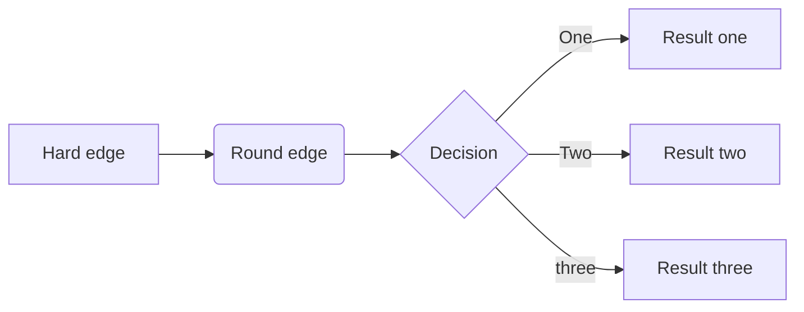
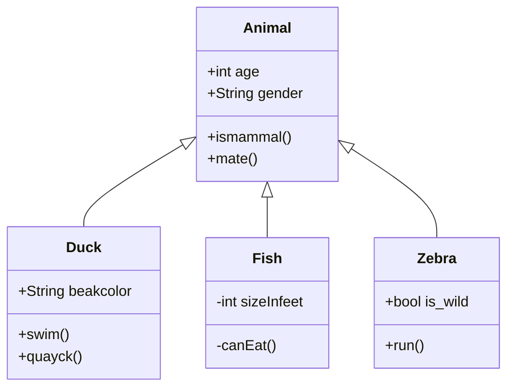
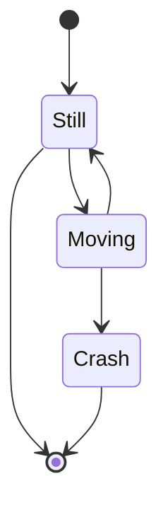

```mermaid
pie
	title 动物数
	"Dogs":386
	"Cats": 85
	"Rats":150
	"Cows":150
```

```mermaid
sequenceDiagram
Alice->>Bob:Hello Bob,how are you?
Note right of Bob:Bob thinks
Bob-->>Alice:I am good thanks!
```

```mermaid
graph LR
A[Hard edge]-->B(Round edge)
B-->C{Decision}
C-->|One| D[Result one]
C-->|Two| E[Result two]
C-->|three| F[Result three]
```

```mermaid
classDiagram
Animal <|-- Duck
Animal <|-- Fish
Animal <|-- Zebra
Animal : +int age
Animal : +String gender
Animal : +ismammal()
Animal : +mate()
class Duck{
			+String beakcolor
			+swim()
			+quayck()
}
class Fish{
			-int sizeInfeet
			-canEat()
}
class Zebra{
			+bool is_wild
			+run()
}
```

```mermaid
stateDiagram
[*]--> Still
Still-->[*]
Still-->Moving
Moving-->Still
Moving-->Crash
Crash-->[*]
```

